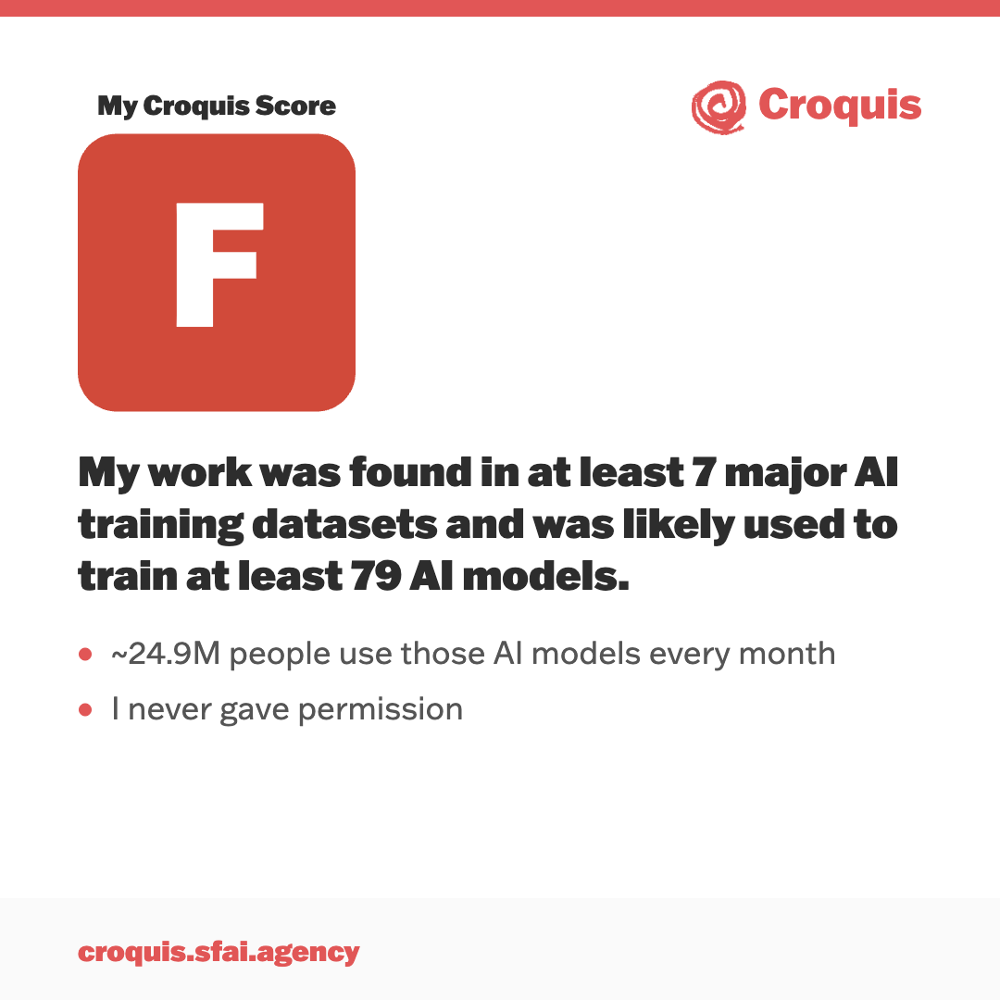

AI companies use "datasets" — basically giant textbooks compiled of data, much of it scraped without permission from the internet. They're tightlipped about what's inside. But that's ok, because we've figured out how to look inside.

Here's an example. We looked for work from award-winning comic book artist [Jamal Igle](https://www.linkedin.com/in/jamalyigle/) (known for his work on everything from DC's Supergirl to Molly Danger). We found that almost 25 million people a month are using AI software likely trained on Jamal's work. [Details here](https://lnkd.in/gR9gsthC).

Want us to look for your work? [Sign up here](https://lnkd.in/gRvU2Zzy).

<figure>
  
</figure>
