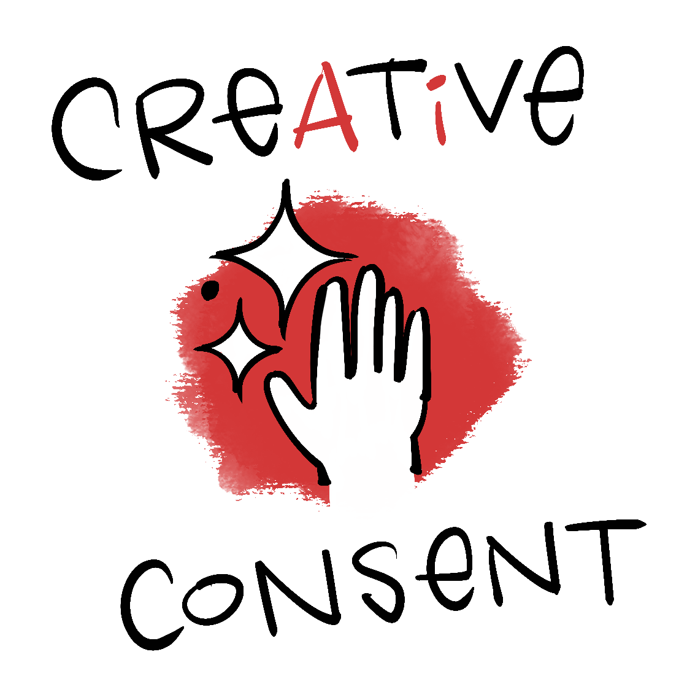

Find out if the machines are chewing on your sketchbook. See what the algorithms took. Decide what you do next. Your work. Your data. Your leverage.

## What is it?

AI can feel like a massive, impenetrable black box, but we've figured out how to pry it open so you can see if your work is stuck inside. Croquis scans AI models to see if your work has been scraped without your permission. We give you the hard data you need to demand compensation, hold big tech accountable, and take your agency back.

## How does it work?

We have two methods for figuring this out.

The first method is called a **Dataset Search**. That's when we look for your name or work in the "textbooks" — giant piles of data, including audio, images, photos, text, and video, used to train AI models.

The second method is to probe the AI models themselves. That's called **Membership Inference**.

You can read more about [how Croquis works here](/faq/).

## Who did this and why? Also, where's the money from?

Croquis was created by Pulitzer Prize–winning editorial cartoonist Mark Fiore and award-winning audio journalist Sally Herships, with **a lot** of help from an AI scholar at Stanford. They're concerned about the copyright and misinformation threats AI presents.

Initial funding came from grants from the Herb Block Foundation and the Brown Institute. Mark and Sally are currently fundraising to grow the company. They're also working on an AI tool that lets artists create new images trained only on their own work, and a clearinghouse so creators who want to license their work can get paid.

## How do I use it?

Croquis is coming soon! If you'd like to join our waiting list, you can do so [here](https://sfai.agency/?signup).

We're also working with design partners — organizations that are willing to help us by testing Croquis and sharing feedback. Let us know if you're interested [here](mailto:mark@sfai.agency?cc=sally@sfai.agency&subject=Croquis%20design%20partner).

## Grr! It makes me so angry that artists' work is used without their permission! Is there anything else I can do?

We're so glad you asked! You can post one of the following on your socials — or create your own:

- © This means you, AI! #creativeconsent
- Stop stealing creativity! #creativeconsent
- There's no "I" in art! #creativeconsent

<figure>
  
</figure>
